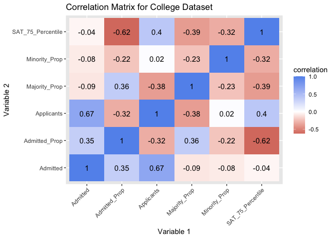

Admission and Diversity Across U.S. Colleges and Universities
================
Dylan Kruse (djk2382)
3/16/2021

## Introduction

For this project, two datasets centering around colleges and
universities were gathered from [Kaggle](www.kaggle.com). The [first
dataset](https://www.kaggle.com/samsonqian/college-admissions), was
created by Samson Qian and highlighted the admission statistics for 1534
colleges and universities. Example variables in the admission dataset
include the total number of applicants and admits, as well as percentile
ranked standardized test scores for the admitted students of the
respective university. While there was no information to be found as to
how the data in this dataset was collected, it was most likely found
through finding information on University websites and compiling what
was found. The data in this dataset takes the form of categorical
variables such as public or private institutions as well as numerical
variables.

The [second
dataset](https://www.kaggle.com/jessemostipak/college-tuition-diversity-and-pay)
was generated by Jesse Mostipak who credits the US Department of
Education and *TuitionTracker.org*. This dataset contains diversity
information for 4,605 colleges and universities. Information such as the
number of black students and the total number of enrolled students can
be found in this dataset. The variables in this dataset are both
numerical and categorical.

My motivation for choosing these datasets stemmed from my desire to
determine if an institution’s level of diversity influenced its
selectivity in the admission process. I know many UT alumni who
continuously remark as to how our own University of Texas has become
more selective with their application process. In concurrence with UT’s
increased level of prestige, the demographics of the university have
also changed over time, becoming more diverse. I believed that by
analyzing an institution’s selectivity alongside their diversity
statistics, it might be found that a higher level of diversity within a
school’s student body led to less students being admitted.

# Working with the data through R

### Importing the datasets

After downloading the datasets in comma-separated-value forms from
[Kaggle](www.kaggle.com), the `read.csv` utility function was used to
import the datasets. The imported admissions and diversity datasets were
saved into dataframes named *raw\_admissions* and *raw\_diversity*
respectively.

``` r
# use `read.csv` create admissions and diversity datasets
raw_admissions <- read.csv("admissions.csv")
raw_diversity <- read.csv("diversity_school.csv")
```

**Was not able to head raw admissions or diversity due to large size**

It is important to note that upon the downloading the datasets, they
were already in tidy form. Each variable had its own column, each
observation had its own row, and each value had its own cell in both
datasets.

##### Calling the Necessary Libraries

After importing the datasets, it was determined to be beneficial to call
every library that would potentially be used. Through this, time was
saved throughout the project.

``` r
library(dplyr)
library(ggplot2)
library(tidyr)
library(kableExtra)
library(tidyverse)
library(cluster)
library(factoextra)
```

## Cleaning the datasets

#### Admission dataset

``` r
# use `select` to select the desired variables in each dataset
select_admissions <- raw_admissions %>%
  select(Name, Applicants.total, Admissions.total, SAT.Critical.Reading.75th.percentile.score, SAT.Math.75th.percentile.score, Control.of.institution, Historically.Black.College.or.University) %>%
  filter(Applicants.total >= 5000)
```

The *raw\_admissions* dataset contained a whopping 108 variables. Many
of these variables were projected values, so, using the `select()`
function, seven variables were selected. The selected variables were the
institution’s name, total number of applicants, total number of admits,
the 75th percentile reading SAT score, the 75th percentile math SAT
score, the institution’s control, and whether or not the school was a
Historically Black College or University (HBCU). Additionally, schools
which had less than 5000 applicants were disregarded using the
`filter()` function. Removing schools with fewer than 5000 applicants
was done so in order to have more visually appealing graphs in the later
stages of the project.

These changes changed the admission dataset from 1534 observations of
108 variables to 487 observations of seven variables. The new dataset
was named *select\_admissions*.

``` r
# create variables for composite SAT scores and admitted proportion using `mutate`
new_admissions <- select_admissions %>%
  mutate(SAT.Composite.75th.percentile.score = SAT.Critical.Reading.75th.percentile.score + SAT.Math.75th.percentile.score,
         Admitted_Prop = Admissions.total/Applicants.total) %>%
  relocate(SAT.Composite.75th.percentile.score, .after = Admitted_Prop) %>%
  relocate(Admitted_Prop, .after = Admissions.total) %>%
  select( -SAT.Critical.Reading.75th.percentile.score, -SAT.Math.75th.percentile.score)
# use `rename` to change the names of variables
ren_admissions <- new_admissions %>%
  rename(
    Applicants = Applicants.total,
    Admitted = Admissions.total,
    SAT_75_Percentile = SAT.Composite.75th.percentile.score,
    Control = Control.of.institution,
    HBCU = Historically.Black.College.or.University) %>%
  relocate(Control, .after = Name) %>%
  relocate(HBCU, .after = Control)
head(ren_admissions)
```

    ##                                  Name                Control HBCU Applicants
    ## 1            Alabama A & M University                 Public  Yes       6142
    ## 2 University of Alabama at Birmingham                 Public   No       5689
    ## 3            Alabama State University                 Public  Yes      10245
    ## 4           The University of Alabama                 Public   No      30975
    ## 5                   Auburn University                 Public   No      15745
    ## 6                 Spring Hill College Private not-for-profit   No       6596
    ##   Admitted Admitted_Prop SAT_75_Percentile
    ## 1     5521     0.8988929               900
    ## 2     4934     0.8672877              1290
    ## 3     5251     0.5125427               960
    ## 4    17515     0.5654560              1260
    ## 5    13027     0.8273738              1270
    ## 6     3052     0.4627047              1200

After the raw data was selected and filtered, new variables were
generated through the `mutate()` function. The two new variables for
each school were the proportion of admission and a composite 75th
percentile SAT score made by dividing the number of admits by applicants
and adding the 75th percentile math and reading SAT scores.

Once the new variables were generated, the variables were rearranged and
renamed using the `relocate()` and `rename()` functions. This was done
so that the data was easier to work with and visualize throughout the
project.

#### Diversity dataset

``` r
# use `select` to select the desired variables in each dataset and filter to remove women, unknown, non-resident, and two or more races
diversity_wo_women <- raw_diversity %>%
  select(-state) %>%
  filter(category != "Women") %>%
  filter(category != "Unknown") %>%
  filter(category != "Non-Resident Foreign") %>%
  filter(category != "Two Or More Races")
# create a dataset with the majority group and majority enrollment
majority <- diversity_wo_women %>%
  group_by(name) %>%
  filter(category != "Total Minority") %>%
  top_n(1, enrollment) %>%
  rename(majority_group = category, majority_enrollment = enrollment)
# create a dataset with the total minority dataset
minority <- raw_diversity %>%
  select(-state, -total_enrollment) %>%
  filter(category == "Total Minority") %>%
  select(-category) %>%
  rename(minority_enrollment = enrollment)
# create the final dataset by using `left_join`
select_diversity <- 
  left_join(majority, minority, by = "name") %>%
  relocate(majority_group, .after = name) %>%
  relocate(total_enrollment, .after = minority_enrollment)
# create proportion variables for each diversity category using `mutate`
new_diversity <- select_diversity %>%
  mutate(Majority_Prop = majority_enrollment/total_enrollment, 
         Minority_Prop = minority_enrollment/total_enrollment)
ren_diversity <- new_diversity %>%
  rename(Total_Enrolled = total_enrollment,
         Majority_Enrolled = majority_enrollment,
         Majority_Group = majority_group, 
         Minority_Enrolled = minority_enrollment)
head(ren_admissions)
```

    ##                                  Name                Control HBCU Applicants
    ## 1            Alabama A & M University                 Public  Yes       6142
    ## 2 University of Alabama at Birmingham                 Public   No       5689
    ## 3            Alabama State University                 Public  Yes      10245
    ## 4           The University of Alabama                 Public   No      30975
    ## 5                   Auburn University                 Public   No      15745
    ## 6                 Spring Hill College Private not-for-profit   No       6596
    ##   Admitted Admitted_Prop SAT_75_Percentile
    ## 1     5521     0.8988929               900
    ## 2     4934     0.8672877              1290
    ## 3     5251     0.5125427               960
    ## 4    17515     0.5654560              1260
    ## 5    13027     0.8273738              1270
    ## 6     3052     0.4627047              1200

The diversity dataset was a bit difficult to work with, as it originally
had 11 different observations for each school due to the groups of
included diversities. To combat this, a dataset was created which
excluded the *women*, *unknown*, *two or more races*, and the
*non-resident foreign* diversity categories. These were excluded using
the `filter()` function in order to isolate the total number of students
belonging to diverse categories and the majority category of students.
Subsequently, a dataset which contained information for only the
diversity category of highest number of enrollments per school was
created. This was done through `group_by()`, `filter()`, and `top_n()`
functions. Similarly, a dataset was created which contained only the
number of total number of minority students enrolled in the institution.

The majority and minority datasets were then combined using the
`left_join()` function and two new variables were generated. The
variables generated through the `mutate()` were proportion of the total
enrolled students belonging to the majority diversity category and the
proportion of students which belonged to the overarching minority
diversity category.

As with the previous admissions dataset, the diversity dataset’s
variables were then manipulated using `relocate()` and `rename()`
functions.

## Joining the datasets

``` r
# use `inner_join` to combine datasets and `drop_na` to remove rows missing observations
college <-
  inner_join(ren_admissions, ren_diversity, by = c("Name" = "name")) %>%
  drop_na() %>% arrange(Name) %>%
  relocate(Majority_Group, .after = HBCU)
head(college)
```

    ##                           Name                Control HBCU Majority_Group
    ## 1 Abilene Christian University Private not-for-profit   No          White
    ## 2           Adelphi University Private not-for-profit   No          White
    ## 3     Alabama State University                 Public  Yes          Black
    ## 4      Albany State University                 Public  Yes          Black
    ## 5             Albright College Private not-for-profit   No          White
    ## 6              Amherst College Private not-for-profit   No          White
    ##   Applicants Admitted Admitted_Prop SAT_75_Percentile Majority_Enrolled
    ## 1      10188     4986     0.4893993              1180              2959
    ## 2       8654     5897     0.6814190              1220              4058
    ## 3      10245     5251     0.5125427               960              4950
    ## 4       8250     1643     0.1991515               950              3450
    ## 5       6060     3776     0.6231023              1130              1369
    ## 6       7927     1132     0.1428031              1530               751
    ##   Minority_Enrolled Total_Enrolled Majority_Prop Minority_Prop
    ## 1              1212           4427     0.6683985     0.2737746
    ## 2              2587           7610     0.5332457     0.3399474
    ## 3              5105           5519     0.8969016     0.9249864
    ## 4              3534           3910     0.8823529     0.9038363
    ## 5               701           2393     0.5720852     0.2929377
    ## 6               779           1792     0.4190848     0.4347098

Using the *tidy* function `inner_join()`, the admissions and diversity
datasets were merged. An inner join was used to join the two datasets
because each dataset had variables that were necessary to keep. An inner
join was used over any type of outer join because the observations,
schools, would have only been useful if that contained values for each
variable. The `arrange()` function was used on the *Name* variable in
order to view the new dataset in alphabetical order of school name.

After the inner join was conducted, the new *college* dataset contained
280 observations of 13 variables with four categorical variables and
nine numerical variables.

## Summary Statistics

#### Admission Rate

``` r
# Create a table with admission proportion summary statistics for the entire dataset
college %>%
  summarize(Mean = mean(Admitted_Prop),
            Median = median(Admitted_Prop),
            SD = sd(Admitted_Prop),
            Variation = var(Admitted_Prop),
            Min. = min(Admitted_Prop),
            Max. = max(Admitted_Prop),
            Range = Max. - Min.) %>%
  kbl(caption = "Summary Statistics for admission Proportion") %>% 
  kable_styling(bootstrap_options = c("striped", "hover", "condensed"))
```

<table class="table table-striped table-hover table-condensed" style="margin-left: auto; margin-right: auto;">
<caption>
Summary Statistics for admission Proportion
</caption>
<thead>
<tr>
<th style="text-align:right;">
Mean
</th>
<th style="text-align:right;">
Median
</th>
<th style="text-align:right;">
SD
</th>
<th style="text-align:right;">
Variation
</th>
<th style="text-align:right;">
Min.
</th>
<th style="text-align:right;">
Max.
</th>
<th style="text-align:right;">
Range
</th>
</tr>
</thead>
<tbody>
<tr>
<td style="text-align:right;">
0.5591409
</td>
<td style="text-align:right;">
0.5994326
</td>
<td style="text-align:right;">
0.2120335
</td>
<td style="text-align:right;">
0.0449582
</td>
<td style="text-align:right;">
0.0568662
</td>
<td style="text-align:right;">
0.9458893
</td>
<td style="text-align:right;">
0.8890232
</td>
</tr>
</tbody>
</table>

To begin analyzing the data, I decided to create summary statistics for
the admission proportion variable, as this was the most enticing
variable to me. The summary statistics table for colleges admitted
proportions was generated by using the `summarize()` and `kbl()`
functions.

Of the 280 colleges being observed, the mean proportion of admitted
students was 0.56 or 56.0 % with a standard deviation of 0.212. The data
must have been rather normally distributed since the median proportion
of admitted students was 0.60 or 60.0 % which is close to the
proportion’s mean. I was surprised to determine that the admission
proportion was nearly 60 %, as I interpreted that as approximately 60 %
of all people who apply to college are admitted across the nation.

The minimum proportion of admitted students was 0.057 and the maximum
proportion was 0.946. Naturally, I wanted to determine which schools in
the nation were the most and least selective.

``` r
# Find Min and Max Schools
college %>%
  filter(Admitted_Prop == min(Admitted_Prop) |
         Admitted_Prop == max(Admitted_Prop)) %>% 
  select(Name, Admitted_Prop) %>%
  kbl(caption = "Schools with Lowest and Highest admission Proportions") %>% 
  kable_styling(bootstrap_options = c("striped", "hover", "condensed"))
```

<table class="table table-striped table-hover table-condensed" style="margin-left: auto; margin-right: auto;">
<caption>
Schools with Lowest and Highest admission Proportions
</caption>
<thead>
<tr>
<th style="text-align:left;">
Name
</th>
<th style="text-align:right;">
Admitted\_Prop
</th>
</tr>
</thead>
<tbody>
<tr>
<td style="text-align:left;">
Stanford University
</td>
<td style="text-align:right;">
0.0568662
</td>
</tr>
<tr>
<td style="text-align:left;">
Virginia State University
</td>
<td style="text-align:right;">
0.9458893
</td>
</tr>
</tbody>
</table>

After using the `filter()` and `select()` functions, I discovered that
Stanford University had the lowest admission rate and Virginia State
University had the highest admission rate.

#### SAT Scores

``` r
# Create a table with admission proportion summary statistics for the entire dataset
college %>%
  summarize(Mean = mean(SAT_75_Percentile),
            Median = median(SAT_75_Percentile),
            SD = sd(SAT_75_Percentile),
            Variation = var(SAT_75_Percentile),
            Min. = min(SAT_75_Percentile),
            Max. = max(SAT_75_Percentile),
            Range = Max. - Min.) %>%
  kbl(caption = "Summary Statistics for 75th Percentile SAT Scores") %>% 
  kable_styling(bootstrap_options = c("striped", "hover", "condensed"))
```

<table class="table table-striped table-hover table-condensed" style="margin-left: auto; margin-right: auto;">
<caption>
Summary Statistics for 75th Percentile SAT Scores
</caption>
<thead>
<tr>
<th style="text-align:right;">
Mean
</th>
<th style="text-align:right;">
Median
</th>
<th style="text-align:right;">
SD
</th>
<th style="text-align:right;">
Variation
</th>
<th style="text-align:right;">
Min.
</th>
<th style="text-align:right;">
Max.
</th>
<th style="text-align:right;">
Range
</th>
</tr>
</thead>
<tbody>
<tr>
<td style="text-align:right;">
1243.904
</td>
<td style="text-align:right;">
1220
</td>
<td style="text-align:right;">
156.7211
</td>
<td style="text-align:right;">
24561.51
</td>
<td style="text-align:right;">
895
</td>
<td style="text-align:right;">
1600
</td>
<td style="text-align:right;">
705
</td>
</tr>
</tbody>
</table>

Next, I decided to explore the 75th percentile SAT scores for schools in
a similar manner to how I explored the admission rate. Again, the
`summarize()` and `kbl()` functions were used to create a table of
summary statistics for the 75th percentile SAT scores of the schools in
this dataset.

To my surprise, the mean 75th percentile SAT score for the schools in
this dataset was 1244. I was very surprised by this number, as the SAT
is out of 1600 points and a 1244 is a relatively high score. The
standard deviation and variation statistics illustrated that there was
decent variability in this variable, as they were 156.72 and 24561.5
respectively. While I was surprised by how high the mean and median SAT
scores were, it did make sense because these scores represented the 75th
percentile of applicants. Had I been able to find a mean SAT score for
each school, the statistics would have been better, but the original
admission dataset only had scores for the 25th and 75th percentiles, and
I chose to focus on 75th percentile scores.

I decided to, again, discover which schools had the highest and lowest
75th percentile SAT scores.

``` r
# Find Min and Max Schools
college %>%
  filter(SAT_75_Percentile == min(SAT_75_Percentile) |
         SAT_75_Percentile == max(SAT_75_Percentile)) %>% 
  select(Name, SAT_75_Percentile) %>%
  kbl(caption = "Schools with Lowest and Highest 75th Percentile SAT Scores") %>% 
  kable_styling(bootstrap_options = c("striped", "hover", "condensed"))
```

<table class="table table-striped table-hover table-condensed" style="margin-left: auto; margin-right: auto;">
<caption>
Schools with Lowest and Highest 75th Percentile SAT Scores
</caption>
<thead>
<tr>
<th style="text-align:left;">
Name
</th>
<th style="text-align:right;">
SAT\_75\_Percentile
</th>
</tr>
</thead>
<tbody>
<tr>
<td style="text-align:left;">
California Institute of Technology
</td>
<td style="text-align:right;">
1600
</td>
</tr>
<tr>
<td style="text-align:left;">
Harvard University
</td>
<td style="text-align:right;">
1600
</td>
</tr>
<tr>
<td style="text-align:left;">
Princeton University
</td>
<td style="text-align:right;">
1600
</td>
</tr>
<tr>
<td style="text-align:left;">
Virginia State University
</td>
<td style="text-align:right;">
895
</td>
</tr>
</tbody>
</table>

In similar fashion, the `filter()` and `select()` functions were used to
discover which schools had the highest and lowest 75th percentile SAT
scores.

Shockingly, three schools had a perfect 1600 75th percentile score, the
California Institute of Technology, Princeton University, and Harvard
University. That’s Ivy League for ya… Virginia State showed the lowest
75th percentile SAT score with it being 895. These results were
consistent with the previous findings that showed Virginia State had the
highest admission proportion.

#### Total Minority Proportion

``` r
# Create a table with admission proportion summary statistics for the entire dataset
college %>%
  summarize(Mean = mean(Minority_Prop),
            Median = median(Minority_Prop),
            SD = sd(Minority_Prop),
            Variation = var(Minority_Prop),
            Min. = min(Minority_Prop),
            Max. = max(Minority_Prop),
            Range = Max. - Min.) %>%
  kbl(caption = "Summary Statistics for Total Minority Proportions") %>% 
  kable_styling(bootstrap_options = c("striped", "hover", "condensed"))
```

<table class="table table-striped table-hover table-condensed" style="margin-left: auto; margin-right: auto;">
<caption>
Summary Statistics for Total Minority Proportions
</caption>
<thead>
<tr>
<th style="text-align:right;">
Mean
</th>
<th style="text-align:right;">
Median
</th>
<th style="text-align:right;">
SD
</th>
<th style="text-align:right;">
Variation
</th>
<th style="text-align:right;">
Min.
</th>
<th style="text-align:right;">
Max.
</th>
<th style="text-align:right;">
Range
</th>
</tr>
</thead>
<tbody>
<tr>
<td style="text-align:right;">
0.3002373
</td>
<td style="text-align:right;">
0.2560702
</td>
<td style="text-align:right;">
0.1784869
</td>
<td style="text-align:right;">
0.0318576
</td>
<td style="text-align:right;">
0.0711183
</td>
<td style="text-align:right;">
0.9708738
</td>
<td style="text-align:right;">
0.8997554
</td>
</tr>
</tbody>
</table>

The same summary statistics which were found for admission proportion
and 75th percentile SAT scores were found for the total proportion of
college students which belonged to a minority. Again, the `summarize()`
and `kbl()` functions were used.

The mean for total minority proportion across the 280 schools was a
lowly 0.30 or 30.0 %. I found this to be a low number seeing as the U.S.
consists of approximately 40.6 % minority individuals
[Wikipedia](https://en.wikipedia.org/wiki/Race_and_ethnicity_in_the_United_States#:~:text=As%20of%20July%202016%2C%20White,estimated%2013.4%25%20of%20the%20population.).
Despite the low mean, the range was a high 0.90. The standard variation
and variation of this variable were 0.178 and 0.0319 respectively.

I decided to determine which U.S. schools had the lowest proportions of
minority students.

``` r
# Find Min and Max Schools
college %>%
  select(Name, Minority_Prop, Majority_Group) %>%
  top_n(-3, Minority_Prop) %>%
  arrange(Minority_Prop) %>%
  kbl(caption = "Schools with Lowest and Highest Total Minority Proportions") %>% 
  kable_styling(bootstrap_options = c("striped", "hover", "condensed"))
```

<table class="table table-striped table-hover table-condensed" style="margin-left: auto; margin-right: auto;">
<caption>
Schools with Lowest and Highest Total Minority Proportions
</caption>
<thead>
<tr>
<th style="text-align:left;">
Name
</th>
<th style="text-align:right;">
Minority\_Prop
</th>
<th style="text-align:left;">
Majority\_Group
</th>
</tr>
</thead>
<tbody>
<tr>
<td style="text-align:left;">
Morehead State University
</td>
<td style="text-align:right;">
0.0711183
</td>
<td style="text-align:left;">
White
</td>
</tr>
<tr>
<td style="text-align:left;">
Keene State College
</td>
<td style="text-align:right;">
0.0752471
</td>
<td style="text-align:left;">
White
</td>
</tr>
<tr>
<td style="text-align:left;">
Plymouth State University
</td>
<td style="text-align:right;">
0.0817714
</td>
<td style="text-align:left;">
White
</td>
</tr>
</tbody>
</table>

In order to determine which schools had the lowest minority percentages,
I used the `select()`, `arrange()`, `top_n()` and `kbl()` functions. It
was found that the three schools with the lowest proportion of
minorities were Morehead State University, Keene State College, and
Plymouth State University with respective total minority proportions of
0.071, 0.075, and 0.08.

#### Diversity Quantile

``` r
# Minority Proportion Quantile Statistics 
college %>%
  summarize("Quantile Minority Proportions" = quantile(Minority_Prop)) %>%
  kbl(caption = "Quantiles for Total Minority Proportion") %>%
  kable_styling(bootstrap_options = c("striped", "hover", "condensed"), position = "center", full_width = F)
```

<table class="table table-striped table-hover table-condensed" style="width: auto !important; margin-left: auto; margin-right: auto;">
<caption>
Quantiles for Total Minority Proportion
</caption>
<thead>
<tr>
<th style="text-align:right;">
Quantile Minority Proportions
</th>
</tr>
</thead>
<tbody>
<tr>
<td style="text-align:right;">
0.0711183
</td>
</tr>
<tr>
<td style="text-align:right;">
0.1860835
</td>
</tr>
<tr>
<td style="text-align:right;">
0.2560702
</td>
</tr>
<tr>
<td style="text-align:right;">
0.3427959
</td>
</tr>
<tr>
<td style="text-align:right;">
0.9708738
</td>
</tr>
</tbody>
</table>

I wanted to see what the admission proportions looked like for the
schools in the upper quantile of total diversity proportion, as that was
what drew me to this topic in the first place. I wanted to determine if
the admission proportion for schools with high diversity differed from
schools without high diversity. To do so, I found the quantile value for
the total minority proportion using `summarize()` and `quantile()`. The
third quantile of total minority proportion was about 0.347.

``` r
# admission Proportion Acceptance Rates Above the Third Quintile Diversity
college %>% 
  filter(Minority_Prop >= 0.3467175) %>%
  summarize(n = n(),
            Mean = mean(Admitted_Prop),
            SD = sd(Admitted_Prop)) %>%
  kbl(caption = "Mean and SD of Admission Proportion for Schools Above the Third Quantile in Total Diversity Proportion") %>% 
  kable_styling(bootstrap_options = c("striped", "hover", "condensed"))
```

<table class="table table-striped table-hover table-condensed" style="margin-left: auto; margin-right: auto;">
<caption>
Mean and SD of Admission Proportion for Schools Above the Third Quantile
in Total Diversity Proportion
</caption>
<thead>
<tr>
<th style="text-align:right;">
n
</th>
<th style="text-align:right;">
Mean
</th>
<th style="text-align:right;">
SD
</th>
</tr>
</thead>
<tbody>
<tr>
<td style="text-align:right;">
69
</td>
<td style="text-align:right;">
0.5100959
</td>
<td style="text-align:right;">
0.203228
</td>
</tr>
</tbody>
</table>

After finding the third quantile of total minority proportion was about
0.347, I used the `filter()` function to only keep schools who had a
minority proportion greater than or equal to 0.347. The mean admission
proportion for these 69 schools was 0.51 with a standard deviation of
0.20. This was lower than the mean admission proportion for all 280
schools found earlier in the project; 0.51 compared to 0.56. While it is
lower, 5 % doesn’t seem to be a large enough difference to constitute a
difference especially when the standard deviations are 0.20 and 0.21.

#### Private vs. Public Institutions

``` r
# Create a table with admission proportion summary statistics grouped by control
college %>%
  group_by(Control) %>%
  summarize(n = n(),
            "Mean Admission Proportion" = mean(Admitted_Prop),
            "SD Admission Proportion" = sd(Admitted_Prop),
            "Mean SAT" = mean(SAT_75_Percentile),
            "SD SAT" = sd(SAT_75_Percentile),
            "Mean Applicants" = mean(Applicants),
            "SD Applicants" = sd(Applicants)) %>%
  kbl(caption = "Summary Statistics for Admission Proportion, SAT, Applicants Based on Institution Control") %>%
  kable_styling(bootstrap_options = c("striped", "hover", "condensed"))
```

<table class="table table-striped table-hover table-condensed" style="margin-left: auto; margin-right: auto;">
<caption>
Summary Statistics for Admission Proportion, SAT, Applicants Based on
Institution Control
</caption>
<thead>
<tr>
<th style="text-align:left;">
Control
</th>
<th style="text-align:right;">
n
</th>
<th style="text-align:right;">
Mean Admission Proportion
</th>
<th style="text-align:right;">
SD Admission Proportion
</th>
<th style="text-align:right;">
Mean SAT
</th>
<th style="text-align:right;">
SD SAT
</th>
<th style="text-align:right;">
Mean Applicants
</th>
<th style="text-align:right;">
SD Applicants
</th>
</tr>
</thead>
<tbody>
<tr>
<td style="text-align:left;">
Private not-for-profit
</td>
<td style="text-align:right;">
155
</td>
<td style="text-align:right;">
0.4886175
</td>
<td style="text-align:right;">
0.2281081
</td>
<td style="text-align:right;">
1310.090
</td>
<td style="text-align:right;">
158.6497
</td>
<td style="text-align:right;">
13164.52
</td>
<td style="text-align:right;">
10728.142
</td>
</tr>
<tr>
<td style="text-align:left;">
Public
</td>
<td style="text-align:right;">
125
</td>
<td style="text-align:right;">
0.6465899
</td>
<td style="text-align:right;">
0.1503598
</td>
<td style="text-align:right;">
1161.832
</td>
<td style="text-align:right;">
108.3434
</td>
<td style="text-align:right;">
13527.82
</td>
<td style="text-align:right;">
8590.829
</td>
</tr>
</tbody>
</table>

One of the categorical variables in my *college* dataset was the
institution’s control, whether it was a private or public school. I
decided to group by the school’s control using the `group_by()`
function. I found the mean and standard deviation admission proportion
for both private and public schools, the mean and standard deviation of
75th percentile SAT scores as well as the mean and standard deviation in
number of applicants. There were 155 private schools and 125 public
schools in this dataset.

As I assumed, the mean admission proportion for private schools was
lower than the mean admission proportion for public schools; 0.489
compared to 0.647. Presumably, the mean 75th percentile SAT score was
also higher for private schools than public schools; 1310 compared to
1162. To my surprise, however, the mean number of applicants to private
and public schools were relatively similar with means of 13164 and 13528
respectively.

``` r
# Create a table with SAT score summary statistics grouped by control
college %>%
  filter(Control=="Public") %>%
  select(Name, Admitted_Prop, SAT_75_Percentile) %>%
  top_n(-3, Admitted_Prop)%>%
  kbl(caption = "Public Universities with the Lowest Admission Proportion") %>% 
  kable_styling(bootstrap_options = c("striped", "hover", "condensed"))
```

<table class="table table-striped table-hover table-condensed" style="margin-left: auto; margin-right: auto;">
<caption>
Public Universities with the Lowest Admission Proportion
</caption>
<thead>
<tr>
<th style="text-align:left;">
Name
</th>
<th style="text-align:right;">
Admitted\_Prop
</th>
<th style="text-align:right;">
SAT\_75\_Percentile
</th>
</tr>
</thead>
<tbody>
<tr>
<td style="text-align:left;">
Albany State University
</td>
<td style="text-align:right;">
0.1991515
</td>
<td style="text-align:right;">
950
</td>
</tr>
<tr>
<td style="text-align:left;">
Chicago State University
</td>
<td style="text-align:right;">
0.2864533
</td>
<td style="text-align:right;">
1040
</td>
</tr>
<tr>
<td style="text-align:left;">
University of North Carolina at Chapel Hill
</td>
<td style="text-align:right;">
0.2759433
</td>
<td style="text-align:right;">
1410
</td>
</tr>
</tbody>
</table>

I then filtered for public colleges with the `filter()` function in
order to see which public schools had the lowest admission proportion. I
did this in hopes of seeing our very own University of Texas, but UT was
unfortunately not among the top three selective public schools.

In order visualize the differences and similarities between private and
public institutions, `ggplot()`, `geom_point()`, and `geom_smooth()`
were used to create a graph.

``` r
# color by control
ggplot(college, 
       aes(Applicants, Admitted_Prop, color = Control)) +
  geom_point(aes(shape = Control)) +
  geom_smooth() +
  theme_bw() + 
  scale_color_brewer(palette="Paired") +
  ggtitle("Total Number of Applicants by Admission Proportion") +
  labs(color = "Control of Institution", shape = "Control of Institution") +
  xlab("Number of Applicants") + ylab("Admitted Proportion") 
```

    ## `geom_smooth()` using method = 'loess' and formula 'y ~ x'

<!-- -->

As indicated by the aforementioned summary statistics, the regression
lines for the private and public schools show that private schools have
a lower average admission proportion than public schools. The number of
applicants, however, is pretty evenly distributed between private and
public schools up until around 33000 applicants. This is understandable
seeing as private schools are normally smaller in size. There is
considerable variation in this graph, as indicated by the large
confidence interval shading of the regression line.

#### Majority Group

``` r
# Create a table with admission proportion summary statistics grouped by majority
college %>%
  group_by(Majority_Group) %>%
  summarize(n = n()) %>%
  kbl(caption = "Number of Schools with Different Majority Categories") %>% 
  kable_styling(bootstrap_options = c("striped", "hover", "condensed"))
```

<table class="table table-striped table-hover table-condensed" style="margin-left: auto; margin-right: auto;">
<caption>
Number of Schools with Different Majority Categories
</caption>
<thead>
<tr>
<th style="text-align:left;">
Majority\_Group
</th>
<th style="text-align:right;">
n
</th>
</tr>
</thead>
<tbody>
<tr>
<td style="text-align:left;">
Asian
</td>
<td style="text-align:right;">
2
</td>
</tr>
<tr>
<td style="text-align:left;">
Black
</td>
<td style="text-align:right;">
18
</td>
</tr>
<tr>
<td style="text-align:left;">
Hispanic
</td>
<td style="text-align:right;">
3
</td>
</tr>
<tr>
<td style="text-align:left;">
White
</td>
<td style="text-align:right;">
257
</td>
</tr>
</tbody>
</table>

As mentioned before, I created a variable named *Majority\_Group* which
indicated what the majority diversity category was for each school.
Using `group_by()`, `summarize()`, and `kbl()` functions, I was able to
determine that of the 280 schools, 257 had a White majority, 18 had a
Black majority, 3 had a Hispanic majority, and only 2 schools had an
Asian majority.

``` r
# Create a table with SAT score summary statistics grouped by control
college %>%
  filter(Majority_Group == "Black") %>%
  select(Name, Majority_Group, HBCU) %>%
  group_by(HBCU) %>%
  summarize(n = n()) %>%
  kbl(caption = "Number of HBCU's in Black Majority Schools") %>%
  kable_styling(bootstrap_options = c("striped", "hover", "condensed"))
```

<table class="table table-striped table-hover table-condensed" style="margin-left: auto; margin-right: auto;">
<caption>
Number of HBCU’s in Black Majority Schools
</caption>
<thead>
<tr>
<th style="text-align:left;">
HBCU
</th>
<th style="text-align:right;">
n
</th>
</tr>
</thead>
<tbody>
<tr>
<td style="text-align:left;">
No
</td>
<td style="text-align:right;">
3
</td>
</tr>
<tr>
<td style="text-align:left;">
Yes
</td>
<td style="text-align:right;">
15
</td>
</tr>
</tbody>
</table>

Of the 18 schools which had a Black majority, I wanted to determine how
many were HBCU institutions. After using the `filter()`, `select()`,
`group_by()`, `summarize()`, and `kbl()` functions, I found that 15 of
the 18 Black majority schools were HBCU’s and 3 were not.

## Correlation

With the variables present in the *college* dataset, I believed there
would be some relatively strong correlation coefficients between
admission variables such as 75th percentile SAT scores and admission
proportion. I was unsure, however, how the total diversity proportion
would correlate to the admission variables.

``` r
# Select Relevant Variables
college_cor <- college %>%
  select(-Total_Enrolled, -Majority_Enrolled, -Minority_Enrolled)
# Select Only Numeric Variables
college_num <- college_cor %>%
  select_if(is.numeric) 
# Create Correlation Heatmap
cor(college_num, use = "pairwise.complete.obs") %>%
  as.data.frame %>%
  rownames_to_column %>%
  pivot_longer(-1, names_to = "other_var", values_to = "correlation") %>%
  ggplot(aes(rowname, other_var, fill=correlation)) +
  geom_tile() +
  scale_fill_gradient2(low="firebrick",mid="white",high="cornflowerblue") +
  geom_text(aes(label = round(correlation,2)), color = "black", size = 4) +
  labs(title = "Correlation Matrix for College Dataset", x = "Variable 1", y = "Variable 2") +
  theme(axis.text.x = element_text(angle = 45, hjust = 1))
```

<!-- -->

To make the correlation heat map, I first removed the *total\_enrolled*,
*minority\_enrolled*, and *majority\_enrolled* using the `select()`
function as I believed they wouldn’t be necessary since the proportion
variables illustrated these values in a consolidated manner. I then
selected all the remaining numeric variables using the `is.numeric()`
function and used the code found in Worksheet 8 to make the heat map.

While the majority of the correlation coefficients were quite small, two
sets of categories had coefficients above (+/-).5: number of applicants
and number of admissions (0.67), and 75th percentile SAT scores and
admission proportion (-0.62). With these in mind, it meant that there
was a relatively strong positive linear relationship between number of
applicants and number of admissions. This means that the greater the
number of applicants the greater number of admissions, or vice versa.
There was also a relatively strong negative linear relationship between
75th percentile and admission proportion. This would mean that the
greater the value of the 75th percentile SAT score, the lower the
admission proportion would be. Both of these relationships are very
intuitive.

## Relationship Visualizations

#### SAT Scores vs. Admission Proportion

Building of the discovery that there was a relatively strong negative
linear relationship between 75th percentile SAT scores and admission
proportion, I wanted to graph their relationship.

This plot was built using `ggplot()`, `geom_point()`, and
`geom_smooth()` functions. The 75th percentile SAT score is plotted on
the x axis while the admission proportion is on the y axis. The coloring
of the points are based on a scale of the total minority proportion of
that given school.

``` r
ggplot(college, aes(SAT_75_Percentile, Admitted_Prop, color = Minority_Prop)) +
  geom_point() +
  geom_smooth() +
  labs(color = "Total Minority Percentage") +
  theme_bw() +
  scale_color_gradient(low="white",high="navy") +
  ggtitle("75th Percentile SAT Scores Influence on Admission Proportions in Schools") +
  xlab("75th Percentile SAT Scores") + ylab("Admitted Proportion")
```

    ## `geom_smooth()` using method = 'loess' and formula 'y ~ x'

<!-- -->

At the lower end of the SAT scores, there appears to be a positive
relationship between SAT scores and admission proportion, but at around
1100, the regression line begins to descend. The regression line adopts
a very negative slope towards the upper end of the SAT score axis. This
relationship is supported by the correlation coefficient determined for
75th percentile SAT scores and admission proportion.

The points that are darker in shading, indicating a higher total
minority proportion, are more present in areas of lower SAT scores but
are pretty evenly distributed throughout the admission proportion axis.
The schools with higher SAT scores and lower admission proportions tend
to be lightly shaded, indicating a low proportion of total diversity in
those school.

## Dimensionality Reduction

I determined that principal component analysis (PCA) would be more
appropriate for my data than k-means/PAM clustering. I came to this
conclusion because many of the variables in my dataset can relate to one
another. Since I have many proportion variables that were derived from
other variables present in the dataset. PCA analysis will help reduce
the dimensionality of my variables.

``` r
# Remove Categorical Variables and Scale Data
college_PCA <- college %>%
  select(-Name, -Control, -HBCU, -Majority_Group, -Applicants) %>%
  scale() %>%           
  prcomp()
# Determine the percentage of variance explained by each component with sdev
PCApercent <- 100* (college_PCA$sdev^2 / sum(college_PCA$sdev^2))
PCApercent
```

    ## [1] 40.4372030 25.2208618 17.5204542  8.3409808  4.7212944  2.1238432  1.4397631
    ## [8]  0.1955995

To perform the PCA analysis, the numeric variables in my dataset were
selected using the `select()` function, scaled so that their means would
be zero with the `scale()` function, and the PCA was performed with the
`prcomp()` function. The percentage of variance explained by each
principal component was then found using the *sdev* data.

Based on the percentage of variance explained by each principal
component, three principal components were determined to be necessary.
This conclusion was reached based on the fact that the sum of the
variance explained by the first three principal components is
approximately 83.18 %.

To validate this determination, a plot was generated to visualize the
percentage of variation explained by each principal component

``` r
# Visualize the percentage of variance explained by each component
perc_data <- data.frame(PCApercent = PCApercent, PC = 1:length(PCApercent))
ggplot(perc_data, aes(x = PC, y = PCApercent)) + 
  geom_col(aes(fill = "blue", color = "black", alpha = .8), show.legend = F) + 
  geom_text(aes(label = round(PCApercent, 2)), size = 4, vjust = -0.5) + 
  ylim(0, 45) + ylab("Percent of Variation Explained")
```

<!-- -->

``` r
# Confirm Selected Number of PC's with `fviz_screeplot`
fviz_screeplot(college_PCA, addlabels = TRUE)
```

<!-- -->

Both the `ggplot()` and `fviz_screeplot()` plots indicate that three
principal components is appropriate to illustrate the data.

``` r
PCA_matrix <- as.data.frame(college_PCA$x) %>%
  mutate(Name = college$Name,
         Admitted_Prop = college$Admitted_Prop) %>%
  relocate(Name, .before = PC1) %>%
  relocate(Admitted_Prop, .after = Name)

ggplot(PCA_matrix, aes(PC1, PC2, color = Admitted_Prop)) +
  geom_point() + scale_color_gradient(low="white",high="navy") +
  labs(color = "Admitted Proportion") + 
  ggtitle("Observations Along Principal Components One and Two")
```

<!-- -->

``` r
ggplot(PCA_matrix, aes(PC1, PC3, color = Admitted_Prop)) +
  geom_point() + scale_color_gradient(low="white",high="navy") +
  labs(color = "Admitted Proportion") + 
  ggtitle("Observations Along Principal Components One and Three")
```

<!-- -->

``` r
ggplot(PCA_matrix, aes(PC2, PC3, color = Admitted_Prop)) +
  geom_point() + scale_color_gradient(low="white",high="navy") +
  labs(color = "Admitted Proportion") + 
  ggtitle("Observations Along Principal Components Two and Three")
```

<!-- -->

Each of these plots show the datapoints from the *college* dataset
represented on two of the three principal components deemed necessary.
While I’m unsure if this is the appropriate manner to illustrate this
data, I am sure that if only one of these plots is to be considered, it
should be the one where the observations are represented on PC1 and PC2
as these are the two principal components which explain the greatest
percentage of variance.
